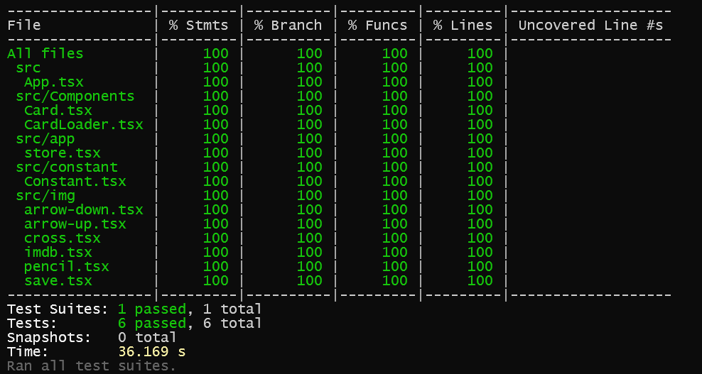

# Проект: Список топ 250 фильмов IMDb

## Видеопрезентация
https://github.com/user-attachments/assets/f5923b7c-5e08-4d44-b132-d9c656fe95c7

## Описание
Проект отображает топ 250 фильмов IMDb с возможностью выбора параметров сортировки и направления сортировки, реализован плавный скролл (при прокрутке страницы до конца отображается "Loading..." и индикатор загрузки - спиннер, а потом после прогрузки отображаются следующие фильмы).

## Технологии
- Для **разработки** использовался Vite + React TS.

- Для **управления стором** использовался MobX.

- Для **отображения списка и элементов интерфейса** использовался Bootstrap, т.к. уже имел опыт работы с ним и он позволяет удобно создавать сетку элементов.

## Покрытие тестами
Все тесты доступны в [App.test.tsx](src/App.test.tsx)

